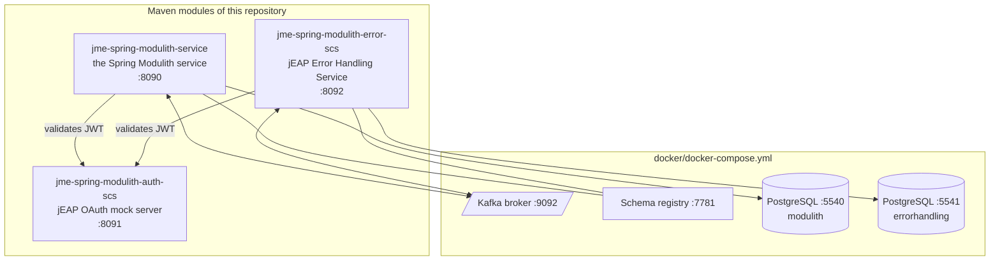
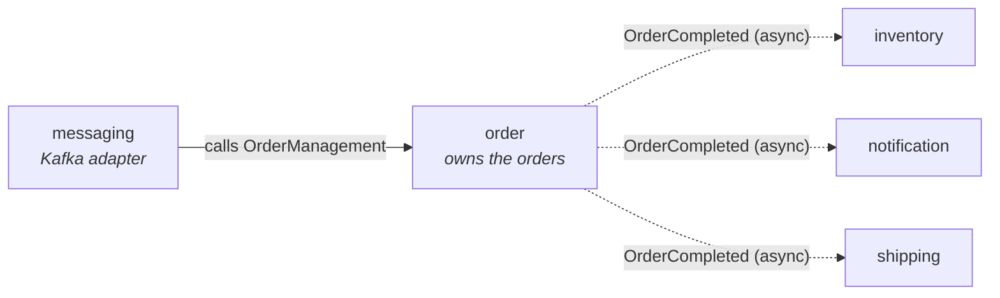
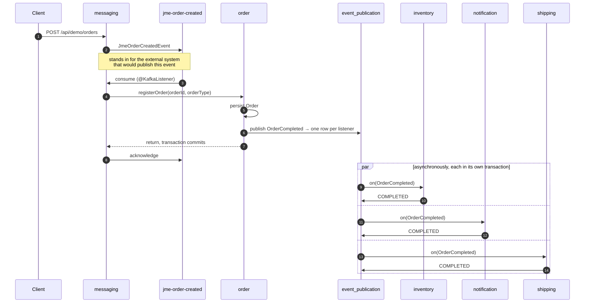
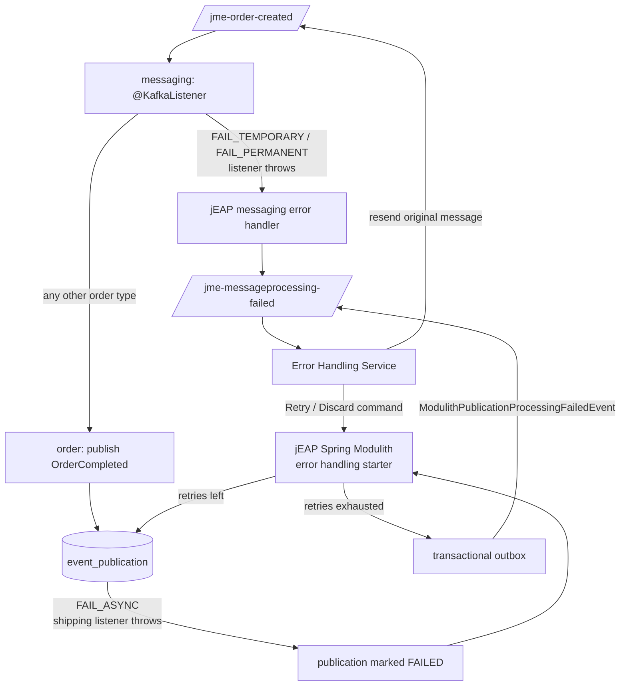
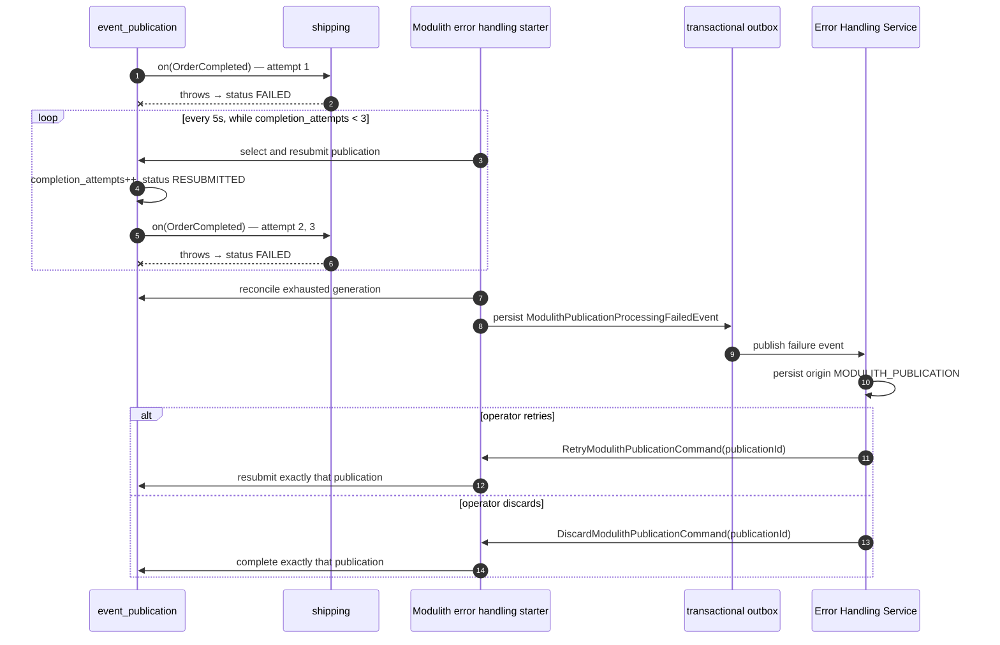

# Architecture

How this example is put together and what happens at runtime. See [Configuration](configuration.md)
for the properties behind it and [async event error handling](async-event-error-handling-design.md)
for the retry, escalation and operator-command design.

## Deployment view

Three runnable services and the infrastructure from `docker/docker-compose.yml`:



The OAuth mock server is not there for decoration: the REST API of the Spring Modulith service *and*
the REST API of the Error Handling Service are OAuth2 resource servers, and both need an issuer.

`jme-spring-modulith-auth-scs` and `jme-spring-modulith-error-scs` contain **no Java code at all** —
they are a pom plus `application*.yml`, pointing `spring-boot-maven-plugin` at the main class of the
jEAP artifact they wrap. That is the standard jEAP way of running an instance of a platform service.

## The application modules

Spring Modulith derives the modules from the package structure: every direct sub-package of the
application's base package `ch.admin.bit.jme.modulith` is one module, its own types are its API, and
anything in a nested package is internal to it.



| Module         | Responsibility                                                                          | REST                                            |
|----------------|-------------------------------------------------------------------------------------------|--------------------------------------------------|
| `order`        | Owns the orders and publishes `OrderCompleted`. Depends on no other module.               | `/api/orders`                                    |
| `inventory`    | Reserves stock for a completed order.                                                     | `/api/inventory`                                 |
| `notification` | Records a notification for a completed order.                                             | `/api/notifications`                             |
| `shipping`     | Hands the order over to the carrier — **and can fail doing so**.                          | `/api/shipments`, `/api/shipments/attempts`      |
| `messaging`    | Consumes `JmeOrderCreatedEvent` from Kafka and translates it into a call on `order`.      | `/api/demo/orders`                               |

Two properties of this arrangement are worth calling out, because they are what Spring Modulith buys:

**The Avro types stay in one module.** `messaging` is the only module that knows
`JmeOrderCreatedEvent`. The domain modules speak their own vocabulary, so a change to the external
contract stops at the module boundary — an anti-corruption layer that `ModularityTests` enforces
rather than merely documents.

**`order` depends on nothing.** Integration runs the other way round: `order` announces what happened
and the other modules decide what that means for them. Adding a fourth reaction to `OrderCompleted`
does not touch `order`.

The dependency rules are declared per module and verified at build time:

```java
@ApplicationModule(displayName = "Inventory", allowedDependencies = "order")
package ch.admin.bit.jme.modulith.inventory;
```

## The happy path



`@ApplicationModuleListener` is Spring Modulith's shortcut for
`@Async @Transactional(REQUIRES_NEW) @TransactionalEventListener`. The listeners therefore run **after
the publishing transaction has committed**, on another thread, each in a transaction of its own. The
`event_publication` row per listener is what makes the delivery survive a crash — and what makes each
listener independently retryable.

Because a publication can be replayed, every listener is idempotent: it checks whether it has already
handled the order and returns without doing anything if so.

## The two failure paths

The example deliberately shows both, because they are genuinely different mechanisms and are easy to
confuse.



### Path 1 — a Kafka message that cannot be consumed

Synchronous, and entirely handled by the jEAP platform. When the `@KafkaListener` throws, the jEAP
messaging error handler wraps the failing message into a `MessageProcessingFailedEvent`, publishes it
to `jme-messageprocessing-failed` and acknowledges the original record, so the consumer is not
blocked. The Error Handling Service persists the failure together with the original message bytes and
either schedules a resend or waits for an operator.

Which of the two happens is decided by the exception, not by the EHS: both exceptions in the
`messaging` module implement `MessageHandlerExceptionInformation` and report a `Temporality`.

| Order type       | Exception                           | Temporality | Result                                                                     |
|------------------|-------------------------------------|-------------|------------------------------------------------------------------------------|
| `FAIL_TEMPORARY` | `TemporaryOrderProcessingException` | `TEMPORARY` | EHS resends the message per its resending strategy, then escalates it        |
| `FAIL_PERMANENT` | `PermanentOrderProcessingException` | `PERMANENT` | EHS records it and waits for a manual retry or delete                        |

The complete wiring between the consumer and the EHS is one property:
`jeap.messaging.kafka.errorTopicName: jme-messageprocessing-failed`.

The event never reaches the `order` module, so no order is registered and no internal event is
published.

### Path 2 — an internal asynchronous event that cannot be processed

Asynchronous, and handled by the jEAP Spring Modulith error handling starter. The Kafka message is
consumed successfully, the order is registered, `OrderCompleted` is published — and then the
`shipping` listener throws for an order of type `FAIL_ASYNC`.



The publications of the `inventory` and `notification` listeners of the *same* event are unaffected
and reach `COMPLETED` — each listener has its own row and its own transaction.

Spring Modulith persists failed publications but does not supply the operational policy. The starter
uses the public registry API for UUID-exact commands and PostgreSQL queries against the JDBC v2 schema
for durable scheduled selection. Its reconciliation sweep is authoritative; the listener-failure
advisor only provides a low-latency escalation attempt.

Note that Spring Modulith counts the **initial** invocation as the first completion attempt, so
`max-completion-attempts: 3` means the listener runs three times in total.

Spring Modulith's broad startup republication is disabled. Old `PUBLISHED`, `PROCESSING` and
`RESUBMITTED` rows are first recovered to `FAILED` by the staleness monitor, after which the starter's
generation-aware claim applies the durable completion-attempt budget. An exhausted `FAILED` row is
therefore not blindly invoked after a process restart.

After retries are exhausted, the publication stays `FAILED` so it remains addressable. Escalation is
idempotent for `(publication_id, completion_attempts)`. A retry that fails again increments the durable
counter and therefore forms a new generation that can be escalated once without duplicating the old
EHS error. A discard marks the publication `COMPLETED` without invoking the listener.

## Persistence

One PostgreSQL per service, schema owned by Flyway (`spring.jpa.hibernate.ddl-auto: validate`).

| Table                          | Owner                          | Migration                            |
|--------------------------------|--------------------------------|--------------------------------------|
| `event_publication`            | Spring Modulith                | `V1__event_publication.sql`          |
| `orders`                       | `order` module                 | `V2__application_modules.sql`        |
| `stock_reservation`            | `inventory` module             | `V2__application_modules.sql`        |
| `notification`                 | `notification` module          | `V2__application_modules.sql`        |
| `shipment`                     | `shipping` module              | `V3__shipping.sql`                   |
| `modulith_publication_failure` | Modulith error handling starter | `V4__modulith_error_handling.sql`    |
| `deferred_message`             | jEAP transactional outbox      | `V4__modulith_error_handling.sql`    |
| `shedlock`                     | scheduled job coordination     | `V4__modulith_error_handling.sql`    |

The modules do not share tables: each owns its own data and the others reach it only through the
module's API.

`event_publication` is created by a migration rather than by Spring Modulith's own schema
initialization (`spring.modulith.events.jdbc.schema-initialization.enabled: false`), because it holds
application state that outlives a restart and therefore deserves a migration history like any other
table. The migration is a verbatim copy of Spring Modulith's
`schemas/v2/schema-postgresql.sql`; the v2 schema is the one that carries `status`,
`completion_attempts` and `last_resubmission_date`, which the failure handling depends on.

## Security

The REST API is an OAuth2 resource server via `jeap-spring-boot-security-starter`, using **semantic
roles** (`system_%tenant_@resource_#operation`), activated by setting
`jeap.security.oauth2.resourceserver.system-name: jme`.

Every application module owns one semantic resource, so the authorization boundaries of the service
are exactly its module boundaries. See [Configuration](configuration.md#roles-and-clients) for the
full table.

Two properties of this fall out of the model rather than being coded:

- Reading and writing are separate operations of the same resource, so a token that may read orders
  may not create them.
- A token for the `order` resource grants nothing on `inventory` — the modules do not share a role.

`OrderApiSecurityTests` asserts both.

## Tests

| Test                            | Module                     | What it covers                                                                     |
|---------------------------------|----------------------------|--------------------------------------------------------------------------------------|
| `ModularityTests`               | `jme-spring-modulith-service` | The module arrangement — fails the build on an illegal dependency or a cycle          |
| `DocumentationTests`            | `jme-spring-modulith-service` | Generates the module documentation and asserts the expected files are produced        |
| `OrderIntegrationTests`         | `jme-spring-modulith-service` | `@ApplicationModuleTest` slice of `order`, including event publication and idempotence |
| `InventoryIntegrationTests`     | `jme-spring-modulith-service` | `@ApplicationModuleTest` slice of `inventory`, driven by a published `OrderCompleted`  |
| `OrderApiSecurityTests`         | `jme-spring-modulith-service` | Semantic role authorization through MockMvc                                            |
| `EventPublicationRecoveryConfigurationTests` | `jme-spring-modulith-service` | Budget-aware restart and staleness recovery configuration                 |
| `SpringModulithExampleIT`       | `jme-spring-modulith-test` | The happy path end to end, plus 401/403 against the running service                    |
| `ErrorHandlingIT`               | `jme-spring-modulith-test` | Both Kafka consumption failures, asserted through the EHS query API                    |
| `InternalAsyncEventRetryIT`     | `jme-spring-modulith-test` | Full automatic retry, EHS generation, duplicate, retry and discard flow                  |

`@ApplicationModuleTest` bootstraps a single module, so a hidden dependency on another module shows up
as a missing bean rather than passing unnoticed. The module tests run against a PostgreSQL started by
Testcontainers; the integration tests start the compose stack and the three services as Maven
subprocesses.

## Related

- [Configuration](configuration.md)
- [Async event error handling](async-event-error-handling-design.md)
- [Root README](../README.md)
