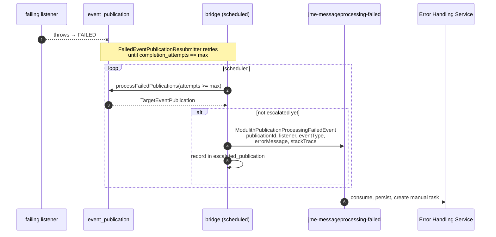
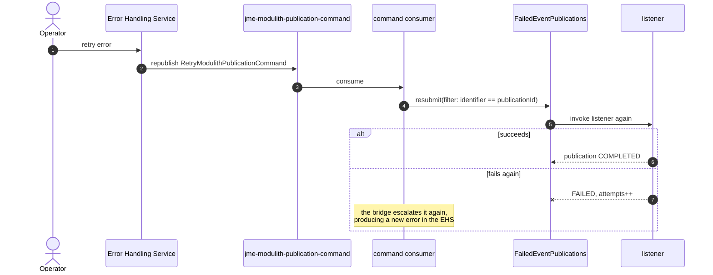

# Design: error handling for failed internal asynchronous events

> **Status: planned.** Nothing in the "Proposed design" section below is implemented. What *is*
> implemented is the failing listener, the retry policy, and the seam the bridge will hook into — plus
> `AsyncEventFailureHooksIntegrationTests`, which proves that every Spring Modulith hook this design
> relies on actually behaves as described here.
>
> The feature is the jEAP enabler **DFEA-4743, "jEAP Error Handling mit Modulith"**. This page is the
> technical design for the application side of it; the enabler describes the scope, and this example
> is its acceptance criterion **E-001** ("Ein JME Example demonstriert das ErrorHandling für Modulith
> Event Publications").

## The problem

A jEAP service has a well-trodden path for a Kafka message it cannot process: the jEAP messaging error
handler wraps it into a `MessageProcessingFailedEvent`, the Error Handling Service (EHS) persists it,
retries temporary failures, and gives an operator a UI to retry or discard permanent ones. Nothing is
lost and somebody is told.

An **internal asynchronous event** has no such path. When an `@ApplicationModuleListener` throws,
Spring Modulith marks its row in `event_publication` as `FAILED` and that is the end of it. The
application can resubmit it (this example does, see
[Architecture](architecture.md#path-2--an-internal-asynchronous-event-that-cannot-be-processed)), but
once the retries are used up the failure is invisible to the operational tooling the rest of the
system uses.

The goal is to close that gap: escalate an exhausted publication to the EHS, and let an operator
retry or discard it from there — the same experience as for a failed Kafka message.

The enabler splits that across three deliverables, which is worth keeping in mind while reading this
page, because only the first one is application-side:

| Deliverable                     | Content                                                                                                                                | Acceptance criteria |
|---------------------------------|------------------------------------------------------------------------------------------------------------------------------------------|---------------------|
| A **jEAP library / starter**    | Publishes `ModulithPublicationProcessingFailedEvent` for publications that could not be processed, and acts on the retry and discard commands | J-001, J-004, J-005 |
| The **Error Handling Service**  | Creates an error from the new event *equivalently to* `MessageProcessingFailedEvent`, and publishes the retry and discard commands          | J-002               |
| The **Error Handling UI**       | Presents and handles Modulith publication errors equivalently to Kafka message errors                                                       | J-003               |

So the "bridge" described below is not application code: it is a starter an application switches on by
configuration. That is what makes the hooks below worth pinning down — a library has to rely on public
Spring Modulith API, not on anything one application happens to do.

```
Kafka event
  → internal async event
    → async event processor fails
      → Spring Modulith resubmission          ← implemented
        → retries exhausted                   ← implemented
          → bridge publishes a failure event                     ← planned
            → jEAP Error Handling Service                        ← planned
              → RetryModulithPublicationCommand / DiscardModulithPublicationCommand
                → this application resubmits or discards it      ← planned
```

## The hooks Spring Modulith offers

These were established by running them, not by reading the reference documentation — see
[`AsyncEventFailureHooksIntegrationTests`](../jme-spring-modulith-scs/src/test/java/ch/admin/bit/jme/modulith/AsyncEventFailureHooksIntegrationTests.java),
which drives a real failing listener against a real PostgreSQL and asserts each of them.

| # | Need              | API                                                                                          | Bean                        |
|---|-------------------|----------------------------------------------------------------------------------------------|-----------------------------|
| 1 | Detect            | `EventPublicationRegistry.findIncompletePublications()`                                        | `EventPublicationRegistry`  |
| 2 | Escalate          | `EventPublicationRegistry.processFailedPublications(ResubmissionOptions, Consumer<TargetEventPublication>)` | `EventPublicationRegistry`  |
| 3 | Retry one         | `FailedEventPublications.resubmit(ResubmissionOptions.defaults().withFilter(byIdentifier))`     | `FailedEventPublications`   |
| 4 | Discard one       | `EventPublicationRegistry.markCompleted(event, targetIdentifier)`                               | `EventPublicationRegistry`  |

Three findings matter for the design:

**`FailedEventPublications` cannot be queried.** Its only method is `resubmit(ResubmissionOptions)`.
The single place it lets you observe a failed publication is the filter predicate, which is invoked
once per candidate — and returning `false` there is the only way to look without resubmitting. That is
serviceable for a retry *policy* (it is how `FailedEventPublicationResubmitter` works) but awkward for
a bridge. `EventPublicationRegistry`, one level down, offers proper enumeration and state changes.

**`processFailedPublications` does not resubmit by itself.** It hands each failed publication to a
`Consumer` and leaves the decision to the callback, which is exactly the shape an escalation needs:
report the failure, leave the publication `FAILED` until somebody says otherwise.

**Discarding is `markCompleted`, not a delete.** Marking a failed publication completed takes it out of
the incomplete set without ever invoking the listener, and a subsequent blanket resubmission does not
bring it back. The row stays for the audit trail.

A `TargetEventPublication` carries everything an error report needs: the publication `UUID`, the event
object, the `PublicationTargetIdentifier` of the listener (its fully qualified method signature), the
status, the completion attempts, the publication date and the last resubmission date.

## Where the bridge is invoked

The bridge ships as a jEAP starter (J-001), so it has to find failed publications through public
Spring Modulith API rather than through anything a particular application does. Three candidate
trigger points, all viable:

| Option                                                                     | Pro                                                                         | Con                                                                                |
|----------------------------------------------------------------------------|-----------------------------------------------------------------------------|------------------------------------------------------------------------------------|
| **A** In the retry policy, at exhaustion (`FailedEventPublicationResubmitter.onRetriesExhausted`) | Simplest; the moment is known exactly                                       | Couples escalation to the application's own retry policy; only fires while the scheduler runs |
| **B** A separate scheduled bridge using `processFailedPublications` with a filter on `completionAttempts >= N` | Retry policy and escalation policy stay independent; picks up anything failed, whatever put it there | One more scheduled job                                                             |
| **C** Nothing extra — rely on B to pick up what the staleness monitor and restart republication produce | No code at all beyond B                                                     | Not a trigger of its own, only a source of failed publications                       |

**Recommendation: B**, with A left in place as the seam it is today. B is more robust because a
publication can become `FAILED` in ways the retry policy never sees — the staleness monitor marking a
publication abandoned by a crashed instance, or an operator marking one failed by hand — and B catches
those too.

**Escalation must be idempotent.** `completion_attempts` records retries, not escalations, so nothing
in `event_publication` remembers that a failure was already reported. The in-memory `Set<UUID>` in
`FailedEventPublicationResubmitter` is enough to stop log spam in one process but is *not* a basis for
publishing events: it is lost on restart and not shared between instances. The bridge needs a small
table of its own, e.g.

```sql
CREATE TABLE escalated_publication
(
    publication_id UUID PRIMARY KEY,
    error_event_id TEXT                     NOT NULL,
    escalated_at   TIMESTAMP WITH TIME ZONE NOT NULL
);
```

and, with more than one instance, ShedLock around the scheduled job — the same pattern the EHS uses
for its own schedulers.

## Proposed design

### How the failure reaches the Error Handling Service

The enabler settles this: a **dedicated `ModulithPublicationProcessingFailedEvent`**, which
"serves the same purpose as the `MessageProcessingFailedEvent` — to notify the error. The essential
difference is that it carries the information about the EventPublication instead of an Avro message."
The EHS is extended to create an error from it equivalently to a `MessageProcessingFailedEvent`
(J-002), and the UI to present it equivalently to a Kafka message error (J-003).

It is worth recording the alternative that was *not* taken, because it explains why the platform work
is worth it. The EHS stores the causing message as raw bytes together with a topic name, and a resend
republishes those bytes unchanged to that topic without ever interpreting them. A bridge could
therefore have reported the failure as an ordinary `MessageProcessingFailedEvent` whose
`payload.originalMessage` is the Avro-serialized `RetryModulithPublicationCommand` and whose
`references.message.topicName` is a command topic the application consumes — and the existing resend
would have delivered exactly that command, with **no change to the EHS at all**.

What that saves in platform work it pays for in honesty: `MessageReference` requires a `partition` and
an `offset` that do not exist for a publication, so both would carry a sentinel that every later query
and report over the EHS data has to know about, and an operator would see a Kafka message that never
existed. The dedicated event says what it means — a publication, a listener and an event type — which
is what makes J-003 possible at all.

Either way the failure is reported with temporality `PERMANENT`, because the application has already
exhausted its own retries. The EHS therefore goes straight to a manual task instead of scheduling a
resend of its own, which is the intended behaviour.

### Message contracts

The three message types are defined in the **jEAP common message type registry** rather than in a
system registry, because the feature is a platform feature: any jEAP system running a Spring Modulith
application needs them. They are on the branch
`feature/JEAP-7446-modulith-publication-messages` of
[`jeap-message-type-registry`](https://github.com/jeap-admin-ch/jeap-message-type-registry), where the
validation build compiles and publishes them as

| Type                                       | Artifact id (group `ch.admin.bit.jeap.messagetype.jeap`) |
|--------------------------------------------|----------------------------------------------------------|
| `ModulithPublicationProcessingFailedEvent` | `modulith-publication-processing-failed-event`           |
| `RetryModulithPublicationCommand`          | `retry-modulith-publication-command`                     |
| `DiscardModulithPublicationCommand`        | `discard-modulith-publication-command`                   |

All three identify the failed processing by the **publication id** — the id of the row in the Spring
Modulith event publication registry. That row is one listener's delivery of one event, which is exactly
the unit that can be retried or discarded, so nothing else is needed to act on it.

#### `ModulithPublicationProcessingFailedEvent`

Reported by the bridge once a publication has exhausted the application's retries. Everything on it
beyond the publication id exists so that a human looking at the error list can decide what to do.

```text
@namespace("ch.admin.bit.jeap.modulith.event.publicationprocessingfailed")
protocol ModulithPublicationProcessingFailedEventProtocol {
  import idl "DomainEventBaseTypes.avdl";

  record ModulithPublicationReference {
    string type = "modulithPublication";
    string publicationId;
  }

  record ModulithPublicationProcessingFailedReferences {
    ModulithPublicationReference publication;
  }

  record ModulithPublicationProcessingFailedPayload {
    string listener;      // fully qualified signature of the listener method
    string eventType;     // fully qualified class name of the internal event
    string errorMessage;
    union{null, string} stackTrace = null;
  }

  record ModulithPublicationProcessingFailedEvent {
    ch.admin.bit.jeap.domainevent.avro.AvroDomainEventIdentity identity;
    ch.admin.bit.jeap.domainevent.avro.AvroDomainEventType type;
    ch.admin.bit.jeap.domainevent.avro.AvroDomainEventPublisher publisher;
    ModulithPublicationProcessingFailedReferences references;
    ModulithPublicationProcessingFailedPayload payload;
    string domainEventVersion;
    string? processId = null;
  }
}
```

Why each payload field is there, and what was deliberately left out:

| Field          | Why it is necessary                                                                                      |
|----------------|------------------------------------------------------------------------------------------------------------|
| `listener`     | One event is delivered to several listeners, each with its own publication. The id alone does not tell a human *which* processing step broke. |
| `eventType`    | Makes the error list readable and groupable without a lookup back into the application.                       |
| `errorMessage` | An error report without a message is not actionable.                                                          |
| `stackTrace`   | The Error Handling Service groups errors by a hash of the stack trace. Optional, because not every failure has a useful one. |

Left out on purpose, and addable later in a `BACKWARD`-compatible version if they turn out to be
needed: `completionAttempts` (how often it already failed — informative, but not needed to act) and
the serialized event (the receiving application still holds it in its own registry, and the Error
Handling Service never needs to interpret it).

#### `RetryModulithPublicationCommand` and `DiscardModulithPublicationCommand`

Both are the same shape, and both carry nothing but the reference — retrying needs no data beyond
knowing *what* to retry, because the event itself is still in the receiving application's registry.

```text
@namespace("ch.admin.bit.jeap.modulith.command.retrypublication")
protocol RetryModulithPublicationCommandProtocol {
  import idl "MessagingBaseTypes.avdl";

  record ModulithPublicationReference {
    string type = "modulithPublication";
    string publicationId;
  }

  record RetryModulithPublicationCommandReferences {
    ModulithPublicationReference publication;
  }

  record RetryModulithPublicationCommandPayload {
  }

  record RetryModulithPublicationCommand {
    ch.admin.bit.jeap.messaging.avro.AvroMessageIdentity identity;
    ch.admin.bit.jeap.messaging.avro.AvroMessageType type;
    ch.admin.bit.jeap.messaging.avro.AvroMessagePublisher publisher;
    RetryModulithPublicationCommandReferences references;
    RetryModulithPublicationCommandPayload payload;
    string? processId = null;
    string commandVersion;
  }
}
```

`DiscardModulithPublicationCommand` is identical with `Discard` in place of `Retry` and the namespace
`ch.admin.bit.jeap.modulith.command.discardpublication`. Why a publication was given up on is recorded
by the Error Handling Service the decision was taken in — the command does not carry a reason, because
nothing on the receiving side would do anything with it.

Note the different base types: commands import `MessagingBaseTypes.avdl` (`AvroMessage*`,
`commandVersion`) and events import `DomainEventBaseTypes.avdl` (`AvroDomainEvent*`,
`domainEventVersion`). That split is the convention throughout the registry, not a choice made here.

The consuming application declares them with `@JeapMessageConsumerContract`.

### Escalation



### Retry

The operator presses retry in the EHS UI. The EHS republishes the stored bytes to the stored topic —
which is the command topic, so the command arrives here:



A resubmission that fails again produces a *new* escalation and therefore a new EHS error for the same
publication — the same behaviour the EHS already has for a resent Kafka message that fails again.

### Discard

Retry maps onto the EHS's existing resend. Discard does not: deleting an error in the EHS today sets
its state to `DELETED`, writes an audit entry and closes the manual task, and **publishes nothing**.
Left at that, the publication in the application would stay `FAILED` forever while the EHS believed
the matter closed.

The enabler resolves this on the platform side rather than in the application: the extended EHS
"publishes a `DiscardModulithPublicationCommand` when the publication is to be discarded", exactly as
it publishes a `RetryModulithPublicationCommand` when it is to be processed again. Discard therefore
travels the same route as retry, and the two stay symmetric.

That is a genuine EHS change, not a configuration detail — worth planning for, because it is the one
part of the flow that has no equivalent in the Kafka path. Two cheaper fallbacks exist if it has to be
deferred: the application exposing discard through its own API (the operator then acts in two places),
or a reconciliation job that asks the EHS API which escalated errors have become `DELETED` and
discards those publications (the `escalated_publication` table already holds the mapping it would
need). Neither is the target state.

Whichever way the command arrives, the application-side effect is one call, hook 4:

```java
registry.markCompleted(publication.getEvent(), publication.getTargetIdentifier());
```

## What the example provides for this

| Piece                                              | Where                                                                    |
|----------------------------------------------------|--------------------------------------------------------------------------|
| A listener that fails on demand                    | `shipping` module, order type `FAIL_ASYNC`                               |
| A retry policy, and the exhaustion seam            | `FailedEventPublicationResubmitter.onRetriesExhausted(…)`                |
| Proof that the four hooks work                     | `AsyncEventFailureHooksIntegrationTests`                                 |
| End-to-end proof of retry and exhaustion           | `InternalAsyncEventRetryIT`                                              |
| A running EHS and OAuth mock server to escalate to | `jme-spring-modulith-error-scs`, `jme-spring-modulith-auth-scs`          |

Implementing the starter should not require changing any of them — only the starter itself, its
command consumer, the `escalated_publication` table, and the Error Handling Service and UI support for
the three message types that are already defined.

This example is acceptance criterion **E-001** of the enabler, so it is also where the finished feature
gets demonstrated: the `FAIL_ASYNC` order type already drives a publication into the state the starter
is meant to pick up.

## Open questions

- **Multiple instances.** The bridge job needs ShedLock, otherwise two instances escalate the same
  publication twice. The command consumer does not: `markResubmitted` refuses to claim a publication
  that is already `RESUBMITTED`, so a duplicated command is harmless.
- **Serialization.** The event inside the publication is serialized by Spring Modulith's own
  `EventSerializer` (Jackson by default), which is unrelated to the Avro serialization of the command.
  The bridge only needs the publication id, so it never has to deserialize the event — but an error
  report that wants to show the event payload does.
- **Retention.** `event_publication` rows for discarded publications are only marked completed. Whether
  they are cleaned up by `CompletedEventPublications.deletePublicationsOlderThan(…)` or kept as an
  audit trail is a policy decision this example does not make.
- **Which failures are worth escalating.** Escalating every exhausted publication may be too noisy for
  a busy system. The filter in the bridge is the place to be selective, e.g. by event type or listener.

## Related

- Enabler **DFEA-4743 "jEAP Error Handling mit Modulith"** — scope, deliverables and acceptance criteria
- [Architecture](architecture.md) — the two failure paths as they are today
- [Configuration](configuration.md) — the retry properties
- [jeap-error-handling](https://jeap-admin-ch.github.io/docs/jeap-error-handling/) — the service this design extends
- [Spring Modulith: Event publication registry](https://docs.spring.io/spring-modulith/reference/events.html)
