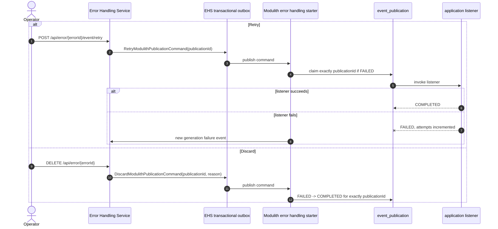

# Error handling for failed internal asynchronous events

> **Status: implemented.** The jEAP Spring Modulith error handling starter, the Error Handling Service
> support and this example implement the complete retry, escalation, retry-command and discard-command
> flow. This example is acceptance criterion **E-001** of **DFEA-4743, "jEAP Error Handling mit
> Modulith"**.

## The problem

The jEAP messaging error handler already gives failed Kafka consumption an operational path: it
publishes a `MessageProcessingFailedEvent`, the Error Handling Service (EHS) persists it, and an
operator can retry or delete a permanent error.

An internal asynchronous Spring Modulith event has a different failure boundary. Each listener has its
own durable row in `event_publication`. When an `@ApplicationModuleListener` throws, Spring Modulith
marks only that listener's publication `FAILED`. Spring Modulith provides resubmission APIs but does not
define a retry budget or integrate exhausted publications with operational tooling.

The implemented flow closes that gap:

```text
Kafka event
  -> internal async event
    -> one Spring Modulith listener fails
      -> starter retries the durable publication
        -> retries exhausted
          -> starter publishes ModulithPublicationProcessingFailedEvent through the outbox
            -> Error Handling Service stores an operator-visible error
              -> RetryModulithPublicationCommand / DiscardModulithPublicationCommand
                -> starter changes exactly the referenced publication
```

The work is split across three deliverables:

| Deliverable | Responsibility |
|---|---|
| jEAP Spring Modulith error handling starter | Persistent retry policy, idempotent escalation, and UUID-exact retry and discard command handling |
| Error Handling Service | Mapping of the failure event to origin `MODULITH_PUBLICATION`, persistence, API/UI projection, and command publication through the transactional outbox |
| Error Handling UI | Display of Modulith publication details and the existing retry/delete operator actions |

## Starter integration

The starter targets Spring Modulith JDBC v2 with PostgreSQL. It runs inside the application that owns
`event_publication`; the consuming application also owns all production Flyway migrations.

### Persistent retry policy

The retry scheduler selects `FAILED` rows below `max-completion-attempts` in PostgreSQL, with the
configured minimum age and batch size. Selection is policy-aware before the SQL limit is applied, so
eligible publications cannot be starved behind older rows rejected by an in-memory filter.

Spring Modulith counts the initial invocation as completion attempt one. In this example,
`max-completion-attempts: 3` therefore means one initial invocation and two automatic retries.
`completion_attempts` is durable, so a process restart does not reset the budget.

The starter uses Spring Modulith's public APIs for resubmission. A small selection context makes the
underlying JDBC claim UUID-exact and preserves Spring Modulith's transition from `FAILED` to
`RESUBMITTED` before invoking the listener.

### Detecting exhausted publications

There are two escalation triggers:

| Trigger | Purpose |
|---|---|
| Listener failure advisor | Low-latency attempt immediately after Spring Modulith has persisted the failed state and incremented the attempt counter |
| Scheduled reconciliation | Authoritative sweep for failures missed because of startup ordering, process termination, transient messaging failure or another exceptional path |

The advisor surrounds the asynchronous listener invocation. A decorator around the public
`EventPublicationRepository` observes the exact publication UUID passed to `markFailed(UUID)` after
delegating the state transition. This avoids package-private Spring Modulith JDBC implementation APIs.

The advisor resolves the escalation service lazily. This is important during Spring startup: eager
creation would initialize outbox and tracing infrastructure while BeanPostProcessors are still being
registered, preventing the final `ObservationRegistry` tracing handlers from being applied.

The reconciliation sweep is the source of truth. Correctness never depends on the in-process advisor
running successfully.

### Transactional, generation-based escalation

An exhausted row remains `FAILED`, because an operator must still be able to target it. The starter
persists this key before writing the failure event through the transactional outbox:

```sql
PRIMARY KEY (publication_id, completion_attempts)
```

This defines a failed **generation**. Repeated observation of attempt three is idempotent across
threads, restarts and service instances. If an operator retries the publication and the listener fails
again, Spring Modulith increments the attempt counter. Attempt four is a new generation and creates a
new EHS error, matching the behavior of a retried Kafka message that fails again.

The transactional outbox makes the escalation marker and outbound event atomic. A database rollback
cannot leave a marker without a corresponding message. The retry and reconciliation sweeps have separate ShedLock
locks, using the application database and database time.

## Message contracts

The failure event stays on `1.0.0`; generation-safe commands use `1.1.0`:

| Type | Artifact id | Version |
|---|---|---|
| `ModulithPublicationProcessingFailedEvent` | `modulith-publication-processing-failed-event` | `1.0.0` |
| `RetryModulithPublicationCommand` | `retry-modulith-publication-command` | `1.1.0` |
| `DiscardModulithPublicationCommand` | `discard-modulith-publication-command` | `1.1.0` |

All three use the Spring Modulith publication UUID as their reference. A publication identifies one
listener's delivery of one event, which is precisely the unit that can be retried or discarded.

### Failure event

`ModulithPublicationProcessingFailedEvent` contains:

| Field | Purpose |
|---|---|
| `publicationId` | UUID-exact operational identity |
| `listener` | Fully qualified listener signature, because one event can have several independent listeners |
| `eventType` | Readable and groupable internal event type |
| `errorMessage` and `errorDescription` | Actionable failure description including the attempt generation |
| `temporality` | `PERMANENT`, because the starter has already exhausted its automatic retry policy |
| `stackTrace` and `stackTraceHash` | Diagnosis and EHS grouping when an exception is available |
| `serializedEvent` and content type | Best-effort JSON payload for operator inspection, bounded by `max-payload-bytes` |
| retry and discard command topic names | Routing information used by the EHS for operator actions |

The serialized event is optional. The immediate path normally has the payload, while reconciliation
must tolerate registry rows whose event cannot be deserialized. Missing display data must not prevent
an otherwise actionable error from being escalated.

The event idempotence ID is `<publicationId>:<completionAttempts>`, the same generation represented by
the database primary key.

### Retry and discard commands

Both commands reference the publication UUID and the failure event identity that reported its exact
completion-attempt generation. The discard command additionally carries the operator's reason when
available. Missing, duplicate, or stale generation tokens are acknowledged as no-ops. The application
declares producer and consumer contracts on its configured topics. The EHS persists the cluster on
which it consumed the failure event and selects that cluster's outbox for the command, without a
default-cluster fallback. In this example the topics are:

| Direction | Topic |
|---|---|
| Failure event to EHS | `jme-messageprocessing-failed` |
| Retry command to application | `jme-retry-modulith-publication` |
| Discard command to application | `jme-discard-modulith-publication` |

## Error Handling Service behavior

The EHS maps the failure event to a permanent error whose causing-event origin is
`MODULITH_PUBLICATION`. It persists the publication UUID, listener, event type, serialized payload and
content type separately from Kafka causing-event data. The error API projects those fields as
`publicationId`, `publicationListener` and `publicationEventType`, allowing the UI to display the
correct context without pretending the internal event is a Kafka record.

Retry and delete retain the established EHS state transitions and audit behavior, but dispatch a
Modulith command instead of resending stored Kafka bytes:



The commands are idempotent and generation exact. Retry claims the referenced publication only while
its current failed generation still matches the reporting failure event; discard uses the same token
in its atomic update. Duplicate Kafka delivery and actions from an older EHS error therefore cannot
re-run a newer generation, re-run a completed listener, or alter an unrelated publication.

## Why discard marks the publication completed

Discard means **stop trying**, not compensate work outside the failed listener transaction. It maps to
Spring Modulith's `COMPLETED` state because the registry has no `DISCARDED` state.

Marking the publication completed:

- removes it from the incomplete set;
- prevents automatic and restart-driven republication;
- does not invoke the listener again;
- retains the registry row for audit and eventual housekeeping.

The discard reason and the fact that completion was operational rather than successful remain in the
EHS audit history. Deleting the publication row would lose more information and is not used.

## Failure and concurrency behavior

| Situation | Result |
|---|---|
| Listener process terminates before immediate escalation | Reconciliation finds the durable failed row |
| Immediate escalation cannot write the outbox | Its transaction rolls back; reconciliation retries |
| Immediate path and reconciliation race | The generation primary key lets only one publish transaction win |
| Two application instances reconcile concurrently | ShedLock serializes scheduled sweeps; the database uniqueness constraint remains the final guard |
| EHS Kafka cluster configuration changes while an error is open | Retry or discard fails and leaves the error open if the stored cluster no longer has an outbox |
| Several services share a command topic | Unsupported for now: the transactional outbox cannot persist the `jeap_eh_target_service` header, so applications must use service-specific retry and discard topics |
| A cluster is removed after a command was persisted | The outbox relay can fall back to the default producer cluster; operators must keep the original cluster configured until pending commands have been relayed |
| Retry command is delivered twice | Only the first command can claim the failed publication |
| Discard command is delivered twice | The second conditional update is a no-op |
| Retry fails again | The incremented completion attempt creates one new EHS generation |
| Event payload is too large | The starter truncates it to `max-payload-bytes` |

## Example coverage

| Piece | Where |
|---|---|
| Listener that fails on demand | `shipping` module, order type `FAIL_ASYNC` |
| Retry, reconciliation and command configuration | `jme-spring-modulith-service/src/main/resources/application.yml` |
| Application-owned schema | `V4__modulith_error_handling.sql` |
| Restart and staleness policy | `EventPublicationRecoveryConfigurationTests` |
| Complete running-system failure lifecycle | `InternalAsyncEventRetryIT` |
| Running EHS and OAuth mock | `jme-spring-modulith-error-scs`, `jme-spring-modulith-auth-scs` |

`InternalAsyncEventRetryIT` verifies the running JME, Kafka, PostgreSQL and EHS instances directly. It
asserts the EHS projection and payload, one error per generation, one listener call for an EHS retry,
a stale duplicated command as a no-op, and discard to `COMPLETED` without another listener call.
