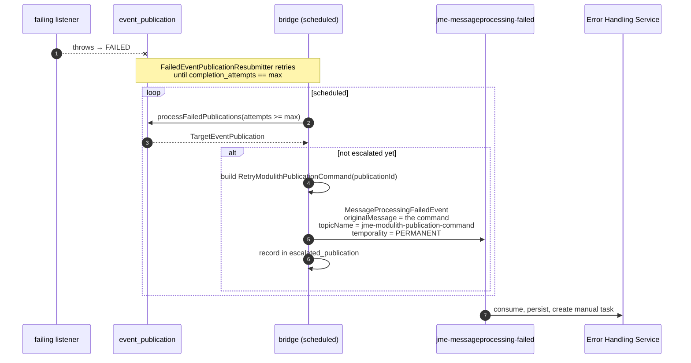
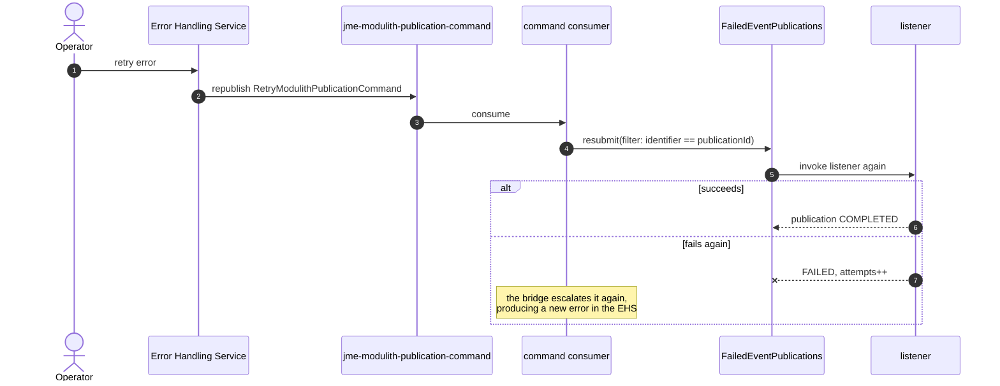

# Design: error handling for failed internal asynchronous events

> **Status: planned.** Nothing in the "Proposed design" section below is implemented. What *is*
> implemented is the failing listener, the retry policy, and the seam the bridge will hook into — plus
> `AsyncEventFailureHooksIntegrationTests`, which proves that every Spring Modulith hook this design
> relies on actually behaves as described here.

## The problem

A jEAP service has a well-trodden path for a Kafka message it cannot process: the jEAP messaging error
handler wraps it into a `MessageProcessingFailedEvent`, the Error Handling Service (EHS) persists it,
retries temporary failures, and gives an operator a UI to retry or discard permanent ones. Nothing is
lost and somebody is told.

An **internal asynchronous event** has no such path. When an `@ApplicationModuleListener` throws,
Spring Modulith marks its row in `event_publication` as `FAILED` and that is the end of it. The
application can resubmit it (this example does, see
[Architecture](architecture.md#path-2--an-internal-asynchronous-event-that-cannot-be-processed)), but
once the retries are used up the failure is invisible to the operational tooling the rest of the
system uses.

The goal is to close that gap: escalate an exhausted publication to the EHS, and let an operator
retry or discard it from there — the same experience as for a failed Kafka message.

```
Kafka event
  → internal async event
    → async event processor fails
      → Spring Modulith resubmission          ← implemented
        → retries exhausted                   ← implemented
          → bridge publishes a failure event                     ← planned
            → jEAP Error Handling Service                        ← planned
              → RetryModulithPublicationCommand / DiscardModulithPublicationCommand
                → this application resubmits or discards it      ← planned
```

## The hooks Spring Modulith offers

These were established by running them, not by reading the reference documentation — see
[`AsyncEventFailureHooksIntegrationTests`](../jme-spring-modulith-scs/src/test/java/ch/admin/bit/jme/modulith/AsyncEventFailureHooksIntegrationTests.java),
which drives a real failing listener against a real PostgreSQL and asserts each of them.

| # | Need              | API                                                                                          | Bean                        |
|---|-------------------|----------------------------------------------------------------------------------------------|-----------------------------|
| 1 | Detect            | `EventPublicationRegistry.findIncompletePublications()`                                        | `EventPublicationRegistry`  |
| 2 | Escalate          | `EventPublicationRegistry.processFailedPublications(ResubmissionOptions, Consumer<TargetEventPublication>)` | `EventPublicationRegistry`  |
| 3 | Retry one         | `FailedEventPublications.resubmit(ResubmissionOptions.defaults().withFilter(byIdentifier))`     | `FailedEventPublications`   |
| 4 | Discard one       | `EventPublicationRegistry.markCompleted(event, targetIdentifier)`                               | `EventPublicationRegistry`  |

Three findings matter for the design:

**`FailedEventPublications` cannot be queried.** Its only method is `resubmit(ResubmissionOptions)`.
The single place it lets you observe a failed publication is the filter predicate, which is invoked
once per candidate — and returning `false` there is the only way to look without resubmitting. That is
serviceable for a retry *policy* (it is how `FailedEventPublicationResubmitter` works) but awkward for
a bridge. `EventPublicationRegistry`, one level down, offers proper enumeration and state changes.

**`processFailedPublications` does not resubmit by itself.** It hands each failed publication to a
`Consumer` and leaves the decision to the callback, which is exactly the shape an escalation needs:
report the failure, leave the publication `FAILED` until somebody says otherwise.

**Discarding is `markCompleted`, not a delete.** Marking a failed publication completed takes it out of
the incomplete set without ever invoking the listener, and a subsequent blanket resubmission does not
bring it back. The row stays for the audit trail.

A `TargetEventPublication` carries everything an error report needs: the publication `UUID`, the event
object, the `PublicationTargetIdentifier` of the listener (its fully qualified method signature), the
status, the completion attempts, the publication date and the last resubmission date.

## Where the bridge is invoked

Three candidate trigger points, all viable:

| Option                                                                     | Pro                                                                         | Con                                                                                |
|----------------------------------------------------------------------------|-----------------------------------------------------------------------------|------------------------------------------------------------------------------------|
| **A** In the retry policy, at exhaustion (`FailedEventPublicationResubmitter.onRetriesExhausted`) | Simplest; the moment is known exactly                                       | Couples escalation to the application's own retry policy; only fires while the scheduler runs |
| **B** A separate scheduled bridge using `processFailedPublications` with a filter on `completionAttempts >= N` | Retry policy and escalation policy stay independent; picks up anything failed, whatever put it there | One more scheduled job                                                             |
| **C** Nothing extra — rely on B to pick up what the staleness monitor and restart republication produce | No code at all beyond B                                                     | Not a trigger of its own, only a source of failed publications                       |

**Recommendation: B**, with A left in place as the seam it is today. B is more robust because a
publication can become `FAILED` in ways the retry policy never sees — the staleness monitor marking a
publication abandoned by a crashed instance, or an operator marking one failed by hand — and B catches
those too.

**Escalation must be idempotent.** `completion_attempts` records retries, not escalations, so nothing
in `event_publication` remembers that a failure was already reported. The in-memory `Set<UUID>` in
`FailedEventPublicationResubmitter` is enough to stop log spam in one process but is *not* a basis for
publishing events: it is lost on restart and not shared between instances. The bridge needs a small
table of its own, e.g.

```sql
CREATE TABLE escalated_publication
(
    publication_id UUID PRIMARY KEY,
    error_event_id TEXT                     NOT NULL,
    escalated_at   TIMESTAMP WITH TIME ZONE NOT NULL
);
```

and, with more than one instance, ShedLock around the scheduled job — the same pattern the EHS uses
for its own schedulers.

## Proposed design

### Reuse `MessageProcessingFailedEvent`

The obvious move is to invent a `ModulithPublicationProcessingFailedEvent`. The cheaper one is to
reuse the contract the EHS already consumes, because of how its retry works.

The EHS stores the causing message as **raw bytes** together with a topic name, and a resend
republishes those bytes unchanged to that topic. It never interprets them. So if the bridge reports
the failure with:

- `payload.originalMessage` = the Avro-serialized **`RetryModulithPublicationCommand`**, and
- `references.message.topicName` = a command topic **this application consumes**,

then the EHS's existing resend — whether triggered by an operator in the UI or by the resending
strategy — delivers exactly that command to exactly this application. **No change to the EHS is
required for the retry path.**

The alternative, a dedicated event type, means teaching the EHS a second inbound contract, a second
error intake path and a second notion of what "resend" means. It buys a cleaner name and a cleaner
audit trail in the EHS. Recommended only if the reuse above turns out to confuse operators looking at
the error list.

Two details of the reuse are not free:

- `MessageReference` requires `partition` and `offset`, and the bridge has neither. They have to be
  filled with a sentinel (`"-1"`) and must not be interpreted anywhere.
- The failure is reported with temporality `PERMANENT`, because the application has already exhausted
  its own retries. The EHS therefore goes straight to a manual task instead of scheduling a resend,
  which is the intended behaviour.

### Message contracts

Two new message types in the
[jme message type registry](https://github.com/jme-admin-ch/jme-message-type-registry), both consumed
by this application and declared with `@JeapMessageConsumerContract`:

```text
@namespace("ch.admin.bit.jme.messaging.command.modulithpublication")
protocol ModulithPublicationCommandProtocol {

    record ModulithPublicationReferences {
        // the event_publication.id of the failed publication
        string publicationId;
    }

    record RetryModulithPublicationPayload {
        // fully qualified listener signature, for traceability
        string listener;
        string eventType;
    }

    record RetryModulithPublicationCommand { … }
    record DiscardModulithPublicationCommand { … }
}
```

The publication `UUID` is the whole key: it identifies one listener's delivery of one event, which is
precisely the unit that can be retried or discarded.

### Escalation



### Retry

The operator presses retry in the EHS UI. The EHS republishes the stored bytes to the stored topic —
which is the command topic, so the command arrives here:



A resubmission that fails again produces a *new* escalation and therefore a new EHS error for the same
publication — the same behaviour the EHS already has for a resent Kafka message that fails again.

### Discard — the open problem

Retry maps onto the EHS for free. **Discard does not.** Deleting an error in the EHS sets its state to
`DELETED`, writes an audit entry and closes the manual task. It publishes nothing. There is therefore
no `DiscardModulithPublicationCommand` on any topic, and the publication in this application stays
`FAILED` forever while the EHS believes the matter is closed.

Three ways out:

| Option                                                                                                                   | Change needed        | Assessment                                                                    |
|--------------------------------------------------------------------------------------------------------------------------|----------------------|---------------------------------------------------------------------------------|
| **D1** Extend the EHS with an optional "publish a compensating message on delete" hook, configured per error type          | EHS feature          | Cleanest end state, symmetric with retry, benefits every system — but needs platform work |
| **D2** The application owns discarding through its own REST API; deleting in the EHS is bookkeeping only                   | none                 | Cheapest, but the operator has to act in two places and the two can drift        |
| **D3** A reconciliation job: the application periodically asks the EHS API which of its escalated errors are now `DELETED`, and discards those publications | none (EHS API only)  | Self-healing and needs no EHS change; costs an EHS client, the `jme_@error_#view` role and a polling interval |

**Recommendation: D3 to begin with, D1 as the target.** D3 makes the feature complete without blocking
on a platform change, and the `escalated_publication` table already holds the mapping from publication
to EHS error that the reconciliation needs. If D1 lands later, the reconciliation job can be dropped
and the discard command flows through the same route as the retry command.

Whatever the trigger, the application-side effect is one call, hook 4:

```java
registry.markCompleted(publication.getEvent(), publication.getTargetIdentifier());
```

## What the example provides for this

| Piece                                              | Where                                                                    |
|----------------------------------------------------|--------------------------------------------------------------------------|
| A listener that fails on demand                    | `shipping` module, order type `FAIL_ASYNC`                               |
| A retry policy, and the exhaustion seam            | `FailedEventPublicationResubmitter.onRetriesExhausted(…)`                |
| Proof that the four hooks work                     | `AsyncEventFailureHooksIntegrationTests`                                 |
| End-to-end proof of retry and exhaustion           | `InternalAsyncEventRetryIT`                                              |
| A running EHS and OAuth mock server to escalate to | `jme-spring-modulith-error-scs`, `jme-spring-modulith-auth-scs`          |

Implementing the bridge should not require changing any of them — only adding the bridge, the command
consumer, the `escalated_publication` table and the two message types.

## Open questions

- **Multiple instances.** The bridge job needs ShedLock, otherwise two instances escalate the same
  publication twice. The command consumer does not: `markResubmitted` refuses to claim a publication
  that is already `RESUBMITTED`, so a duplicated command is harmless.
- **Serialization.** The event inside the publication is serialized by Spring Modulith's own
  `EventSerializer` (Jackson by default), which is unrelated to the Avro serialization of the command.
  The bridge only needs the publication id, so it never has to deserialize the event — but an error
  report that wants to show the event payload does.
- **Retention.** `event_publication` rows for discarded publications are only marked completed. Whether
  they are cleaned up by `CompletedEventPublications.deletePublicationsOlderThan(…)` or kept as an
  audit trail is a policy decision this example does not make.
- **Which failures are worth escalating.** Escalating every exhausted publication may be too noisy for
  a busy system. The filter in the bridge is the place to be selective, e.g. by event type or listener.

## Related

- [Architecture](architecture.md) — the two failure paths as they are today
- [Configuration](configuration.md) — the retry properties
- [jeap-error-handling: MessageProcessingFailedEvent](https://jeap-admin-ch.github.io/docs/jeap-error-handling/) — the contract this design reuses
- [Spring Modulith: Event publication registry](https://docs.spring.io/spring-modulith/reference/events.html)
